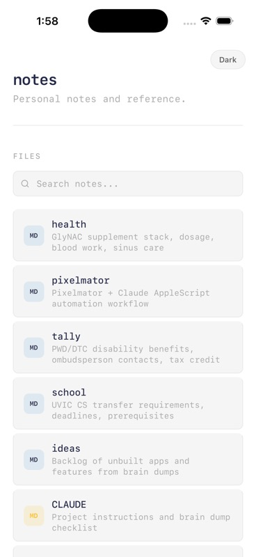

# notes

   [](https://github.com/nulljosh/notes)

Personal notes and reference. Maintained as plain markdown, viewable at [notes.heyitsmejosh.com](https://notes.heyitsmejosh.com) and natively on iOS.

<p align="center">
  
</p>

## Notes

- `master.md` — all notes combined: tasks, health, timeline, school, benefits
- `health.md` — GlyNAC supplement stack, blood work, sinus care
- `tally.md` — PWD/DTC disability benefits, contacts, tax credit
- `timeline.md` — 5-year roadmap: college, career, projects
- `school.md` — UVIC CS transfer requirements, deadlines, prereqs
- `pixelmator.md` — Pixelmator + Claude AppleScript workflow
- `reminders.md` — synced from Apple Reminders

## Architecture


Markdown files rendered as a static site via `index.html` + `pages/`. Notes sync from Apple Reminders via `scripts/sync-reminders.sh`. iOS app is a WKWebView wrapper of the live site.

## Build (iOS)

```bash
cd ios
xcodegen generate
open notes.xcodeproj
```

## Scripts

```bash
./scripts/simplify.sh      # normalize structure
./scripts/sync-reminders.sh  # sync Apple Reminders → reminders.md
./scripts/ship.sh .        # deploy
```

## License

MIT 2026, Joshua Trommel
