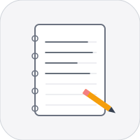
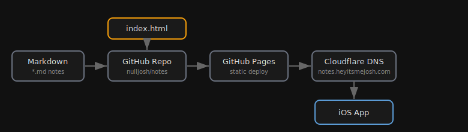

<div align="center">

# Notes



Personal notes repo. Converted from PDF brain dumps, maintained as markdown.

[notes.heyitsmejosh.com](https://notes.heyitsmejosh.com)

</div>

## Architecture



## Structure
```
notes/
  tally.md        # PWD/DTC disability benefits, contacts, tax credit
  timeline.md     # 5-year roadmap: college, career, projects
  school.md       # UVIC CS transfer reqs, deadlines, prereqs
  pixelmator.md   # Pixelmator + Claude AppleScript workflow
  health.md       # GlyNAC supplement stack, blood work, sinus care
  index.html      # Apple Liquid Glass dashboard
```

## Conventions
- Plain markdown, no frontmatter
- Keep notes concise -- bullet points over paragraphs
- TODOs use `- [ ]` checkbox format
- Completed items use `- [x]` -- prune periodically

## License

MIT 2026, Joshua Trommel
